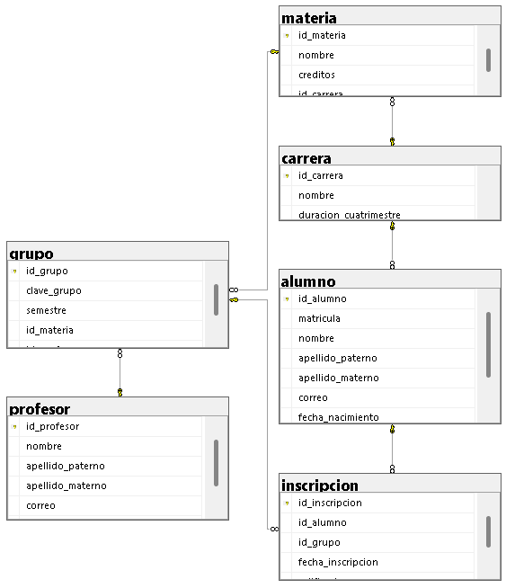

# Ejercicio 01: Control Escolar

## Diagrama Relacional

## Script SQL

El código de creación de la base de datos se encuentra en [01-Ejercicio-ControlEscolar.sql](./01-Ejercicio-ControlEscolar.sql).
