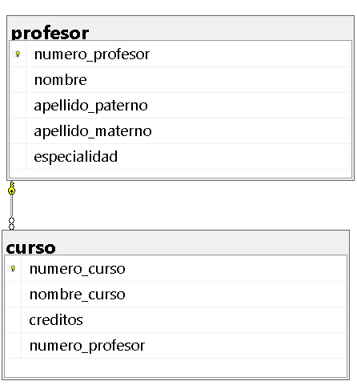

# Ejercicio 03: Control Académico (Universidad)

## Diagrama Relacional

## Script SQL

El código de creación de la base de datos se encuentra en [03-Ejercicio-bduniversidad.sql](./03-Ejercicio-bduniversidad.sql).
