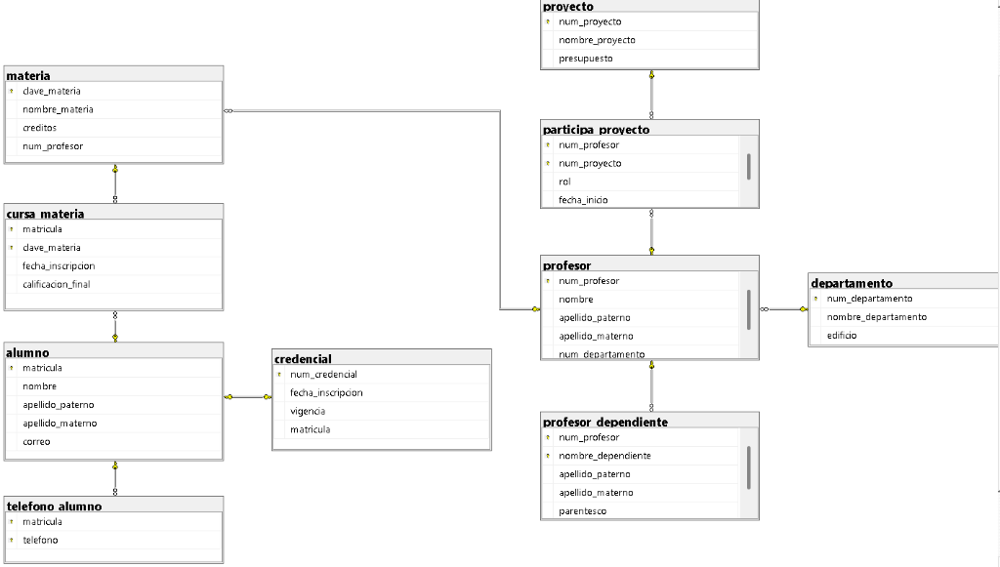

# Ejercicio 10: Académico Institucional

## Diagrama Relacional

## Script SQL

El código de creación de la base de datos se encuentra en [10-Ejercicio-academicoinstitucional.sql](./10-Ejercicio-academicoinstitucional.sql).
