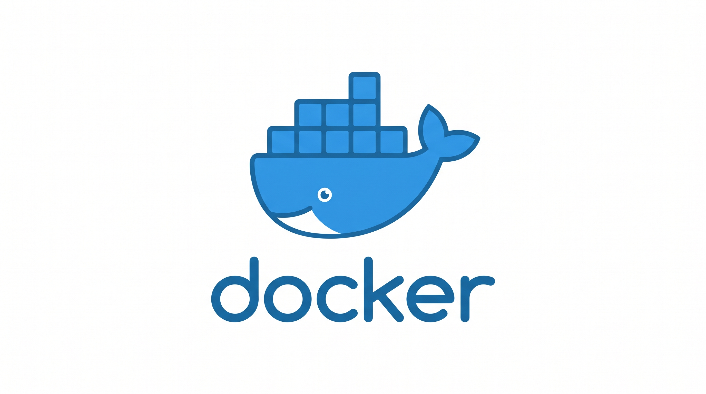

# Documentacion de contenedores de sistemas gestores de base de datos 

docker pull docker/getting-started

## Contenedor de DBMS MariaDB
docker pull mariadb

docker run--nameServerMariaDBG2 -e MARIADB_ROOT_PASSWORD=123456 \ 
-d -p 3345:3306  e0236

| Comando | Descripcion |
| :--- | :--- |
| docker pull nombre_imagen | **Descarga imagen de dockerHUB** [Docker Hub](https://hub.docker.com/) |
| docker images | **Visualizar las imagenes que se encuentren en el docker**  |