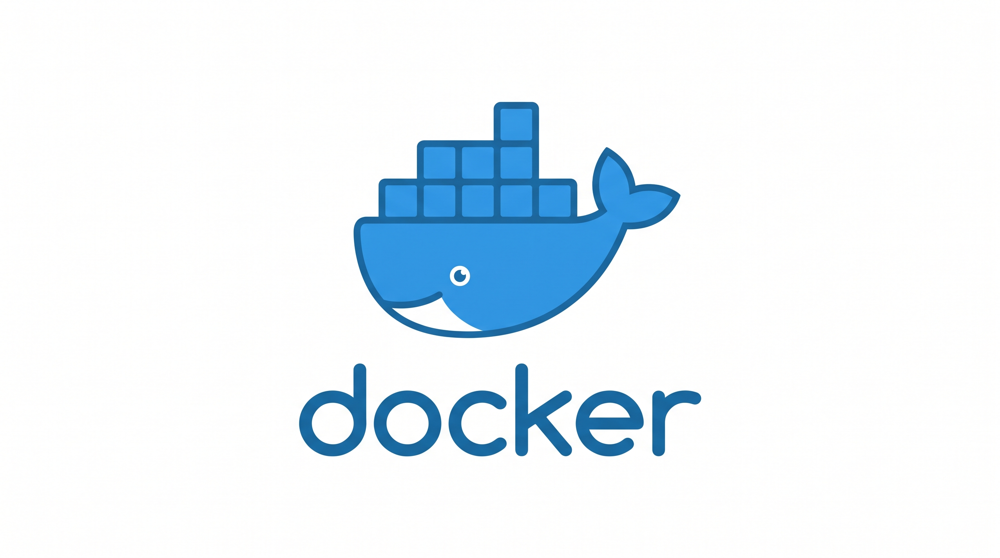

# Documentacion de contenedores de sistemas gestores de base de datos 

docker pull docker/getting-started

## Contenedor de DBMS MariaDB
docker pull mariadb

# Contenedor de MariaDB sin volumen 
docker run --nameServerMariaDBG2 -e MARIADB_ROOT_PASSWORD=123456 \ 
-d -p 3345:3306  e0236

# contenedor de mariadb con volumen
docker run --name ServerMariaDBG2 -e MARIADB_ROOT_PASSWORD=123456 -d -v v-mariadbg2:/var/lib/mysql -p 3345:3306 e0236

# Contenedor de postgress con volumen
docker run --name serverposgresG2 -e POSTGRES_PASSWORD=123456 -d -p 5457:5432 -v v-postgresg2:/var/lib/postgresql/data eba8d

#   Contenedor de SQLServer 2022 con volumen

docker run -e "ACCEPT_EULA=Y" -e "MSSQL_SA_PASSWORD=P@ssw0rd" \
-u 0 \
-p 1452:1433 --name SQLServerG2 \
-d -v vol-sqlserverg3:/var/opt/mssql/data \
d01cc

| Comando | Descripcion |
| :--- | :--- |
| docker pull nombre_imagen | **Descarga imagen de dockerHUB** [Docker Hub](https://hub.docker.com/) |
| docker images | **Visualizar las imagenes que se encuentren en el docker**  |
| docker ps | **Visualizar todos los contenedores que esten encendidos**  |
| docker ps -a | **Visualizar todos los contenedores que estan encendidos o apagados **  |
| docker stop idcontenedor o nombrecontenedor | **Detiene un contenedor**  |
| docker start idcontenedor o nombrecontenedor | **Enciende un contenedor**  |
| docker rm idcontenedor o nombrecontenedor | **Elimina un contenedor pero si esta apagado**  |
| docker rm -f idcontenedor o nombrecontenedor | **Elimina un contenedor de forma forzosa**  |

